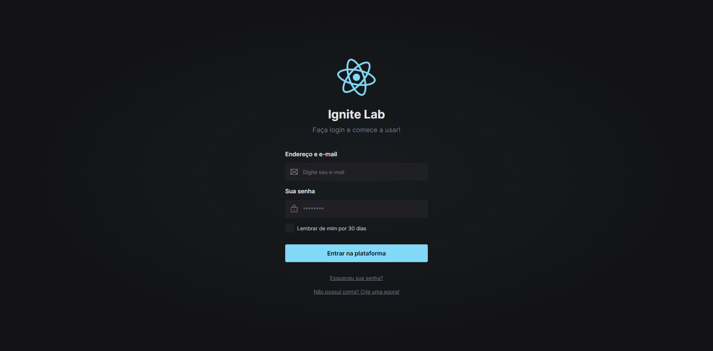
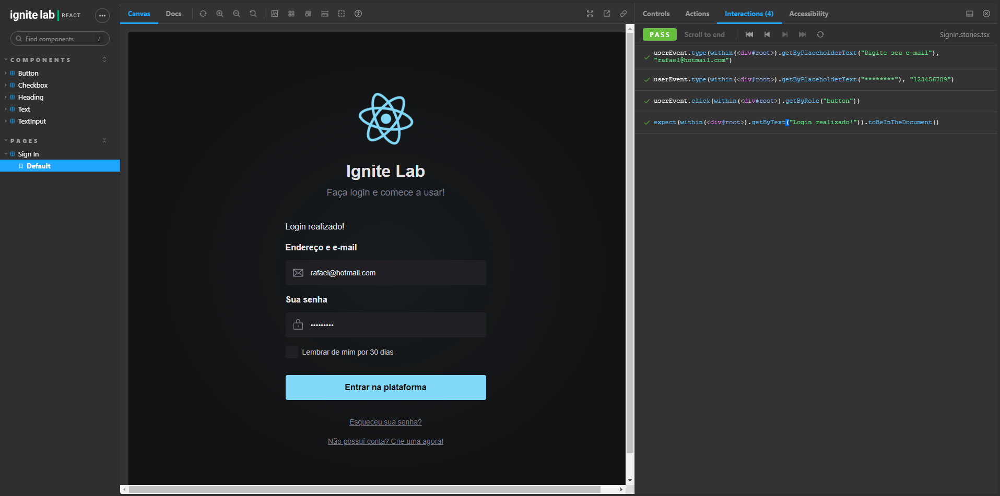

<p align='center'></p>
<h1 align='center'>IgniteLab 3 - Design System</h1>
<p align='center'>


</p>

## 🔖 Descrição
<p>Desenvolvimento de um design system utilizando Figma e documentando todos os nossos componentes criados no Storybook.<p>

## ⚙️ Funcionalidades
- Documentação dos componentes via Storybook;
- Testes básicos de acessibilidade e funcionalidade;
- Deploy automatico (CI/CD) no Github;


## 🚀 Tecnologias
Esse projeto está utilizando as seguintes tecnologias:

- [ViteJS](https://vitejs.dev/)
- [Typescript](https://www.typescriptlang.org/)
- [Storybook](https://storybook.js.org/)


## 🎲 Como utilizar
### Clone esse repositório
```bash
git clone https://github.com/rafaasimi/ignitelab3-designsystem.git
```
### Navegue até o diretório
```bash
cd ignitelab3-designsystem
```
### Instale as dependências
```bash
npm i
```
```bash
yarn
```
### Inicie a aplicação Web
```bash
yarn dev
npm run dev
```
### Inicie o Storybook
```bash
yarn storybook
npm run storybook
```


## 🖼️ Layout



---
<p>Criado com 💙 por <a href='https://github.com/rafaasimi/' target='_blank'>Rafael Simionato</a></p>
